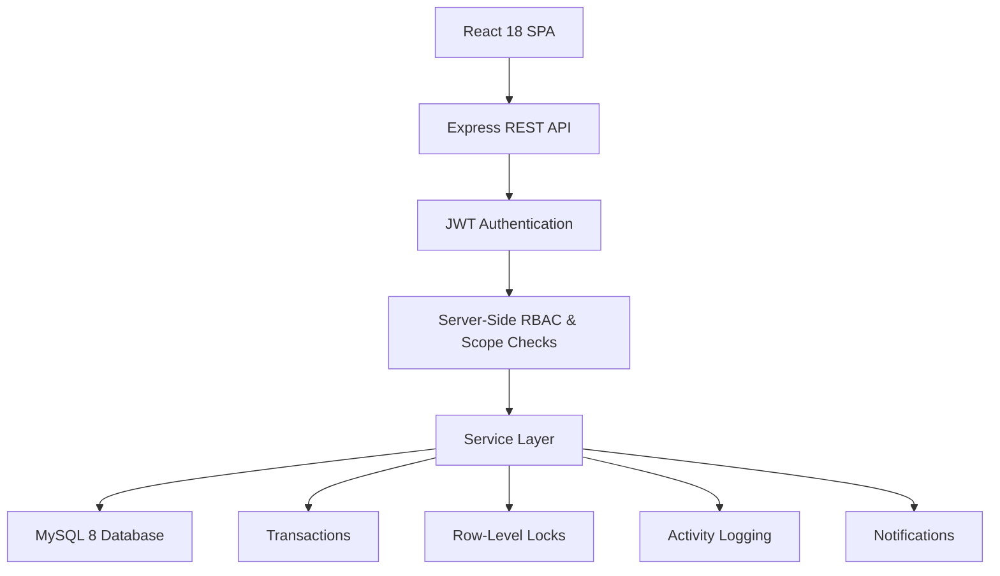
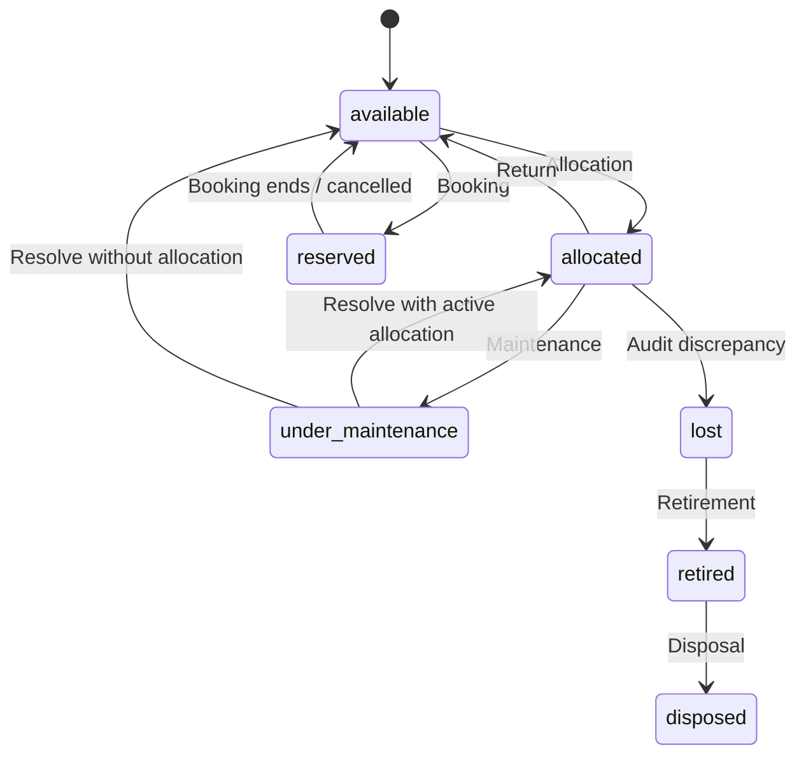

# AssetFlow

> **Enterprise Asset & Resource Management SaaS Platform**
> A full-stack web application for managing physical asset lifecycles, resource allocations, maintenance workflows, departmental audits, bookings, and operational activity.

---

## Table of Contents

* [Overview](#overview)
* [Key Features](#key-features)
* [Architecture & Tech Stack](#architecture--tech-stack)
* [Core Asset Lifecycle & State Model](#core-asset-lifecycle--state-model)
* [Security & Data Integrity](#security--data-integrity)
* [User Roles & Permissions](#user-roles--permissions)
* [API Overview](#api-overview)
* [Project Structure](#project-structure)
* [Local Setup & Installation](#local-setup--installation)
* [Testing & Quality Verification](#testing--quality-verification)
* [Future Improvements](#future-improvements)
* [Project Status & License](#project-status--license)

---

## Overview

Physical asset management in organizations often relies on spreadsheets and manual record-keeping, making it difficult to track ownership, transfers, maintenance, bookings, and audit discrepancies.

**AssetFlow** centralizes these workflows in a role-based web application. Built with **React 18**, **Node.js/Express**, and **MySQL 8**, the platform implements server-side Role-Based Access Control (RBAC), department-scoped access, ACID transaction safety, row-level locking, and persistent activity logging.

---

## Key Features

### Asset Lifecycle & Catalog Management

* **Automated Asset Tagging:** Generates unique asset tags such as `AF-0001` and tracks serial numbers, acquisition dates, physical condition, and locations.
* **Defined Lifecycle States:** Supports `available`, `allocated`, `reserved`, `under_maintenance`, `lost`, `retired`, and `disposed`.
* **Asset History:** Maintains historical records across allocations, transfers, maintenance, and audit findings.

### Allocation & Return Workflows

* **Asset Allocation:** Assigns assets to employees with expected return dates.
* **Return Processing:** Captures return condition notes and restores the appropriate asset state.
* **Double-Allocation Prevention:** Uses database row locking (`SELECT ... FOR UPDATE`) and transaction boundaries to prevent concurrent allocation conflicts.

### Asset Transfer Requests

* **Transfer Requests:** Allows authenticated users to request transfers for allocated assets.
* **Approval Workflow:** Administrators, Asset Managers, and appropriately scoped Department Heads can approve or reject transfer requests.
* **Reallocation:** Approved transfers update the active allocation and maintain the corresponding asset history.

### Time-Slot Resource Booking

* **Shared Resource Reservations:** Supports bookings for bookable assets and shared equipment.
* **Overlap Protection:** Prevents conflicting reservations through transactional checks and returns `HTTP 409 Conflict` for overlapping time windows.
* **Booking Ownership:** Users can manage their own eligible bookings while server-side authorization prevents unauthorized cancellation.

### Maintenance & State Restoration

* **Maintenance Lifecycle:** Supports request creation, approval/rejection, technician assignment, in-progress tracking, and resolution.
* **State Restoration:** Resolving maintenance restores an asset to `allocated` when an active allocation still exists; otherwise it returns the asset to `available`.
* **Role-Based Management:** Maintenance approval and resolution are restricted to authorized administrative roles.

### Audit Cycles & Discrepancy Reconciliation

* **Audit Cycles:** Supports departmental and location-based audit cycles.
* **Audit Findings:** Records `verified`, `missing`, and `damaged` findings.
* **Discrepancy Handling:** Closing an audit cycle processes discrepancies atomically and transitions confirmed missing assets to `lost`.

### Notifications & Activity Logging

* **In-App Notifications:** Provides targeted notifications for relevant asset, transfer, and maintenance workflow events.
* **Activity Logging:** Records important state-changing operations to provide an operational audit history.

---

## Architecture & Tech Stack



### Technology Stack

| Layer              | Technology                                                                      |
| ------------------ | ------------------------------------------------------------------------------- |
| **Frontend**       | React 18, React Router v6, Vite                                                 |
| **UI**             | Custom Vanilla CSS design system, responsive CSS Grid, glassmorphism components |
| **Backend**        | Node.js, Express.js                                                             |
| **Database**       | MySQL 8.0, `mysql2/promise`                                                     |
| **Authentication** | JWT, `bcryptjs`                                                                 |
| **Data Integrity** | ACID transactions, `SELECT ... FOR UPDATE` row locking                          |
| **Development**    | Git, GitHub, VS Code                                                            |

---

## Core Asset Lifecycle & State Model

AssetFlow models assets through explicit lifecycle states and validates state-changing operations on the server.



The lifecycle is protected by server-side validation, transaction boundaries, and concurrency controls to prevent invalid or conflicting state changes.

---

## Security & Data Integrity

* **Server-Side RBAC:** Roles including `admin`, `asset_manager`, `department_head`, and `employee` are enforced at the backend API layer.
* **IDOR Protection:** Ownership checks prevent users from accessing or modifying resources belonging to other users where ownership restrictions apply.
* **Department Scoping:** Department Heads are restricted to operations within their authorized department scope.
* **ACID Transaction Safety:** Multi-step operations such as transfer approval, maintenance resolution, and audit closure execute within database transactions.
* **Concurrency Control:** Critical operations use `SELECT ... FOR UPDATE` row locks to prevent race conditions during allocation and booking workflows.
* **Sanitized Error Responses:** Unexpected server errors return sanitized JSON responses without exposing SQL statements, stack traces, or internal database details.
* **Secret Protection:** Environment configuration is stored in git-ignored `.env` files; credentials are not committed to the repository.

---

## User Roles & Permissions

| Action / Permission              | Admin | Asset Manager | Department Head  | Employee |
| -------------------------------- | ----- | ------------- | ---------------- | -------- |
| View Inventory Catalog & History | Yes   | Yes           | Yes              | Yes      |
| Book Shared Resources            | Yes   | Yes           | Yes              | Yes      |
| Request Asset Transfer           | Yes   | Yes           | Yes              | Yes      |
| Raise Maintenance Ticket         | Yes   | Yes           | Yes              | Yes      |
| Register New Assets              | Yes   | Yes           | No               | No       |
| Allocate / Process Returns       | Yes   | Yes           | Department Scope | No       |
| Approve / Reject Transfers       | Yes   | Yes           | Department Scope | No       |
| Manage Maintenance & Technicians | Yes   | Yes           | No               | No       |
| Open & Close Audit Cycles        | Yes   | No            | No               | No       |
| Record Audit Findings            | Yes   | Yes           | Yes              | No       |
| Manage Departments & Categories  | Yes   | No            | No               | No       |
| Promote Employee Roles           | Yes   | No            | No               | No       |

---

## API Overview

| Module          | Endpoint                                    | Method | Required Role               | Description                                          |
| --------------- | ------------------------------------------- | ------ | --------------------------- | ---------------------------------------------------- |
| **Auth**        | `/api/auth/signup`                          | `POST` | Public                      | Register a new employee account                      |
| **Auth**        | `/api/auth/login`                           | `POST` | Public                      | Authenticate a user and issue a JWT                  |
| **Assets**      | `/api/assets`                               | `GET`  | Authenticated               | List assets with search and filtering                |
| **Assets**      | `/api/assets`                               | `POST` | Admin / Manager             | Register a new asset                                 |
| **Assets**      | `/api/assets/:id/allocate`                  | `POST` | Admin / Manager / Dept Head | Allocate an asset to an employee                     |
| **Assets**      | `/api/assets/allocations/:id/return`        | `PUT`  | Admin / Manager / Dept Head | Process an asset return                              |
| **Assets**      | `/api/assets/:id/transfer-request`          | `POST` | Authenticated               | Submit an asset transfer request                     |
| **Assets**      | `/api/assets/transfer-requests/:id/approve` | `PUT`  | Admin / Manager / Dept Head | Approve a transfer request                           |
| **Bookings**    | `/api/bookings`                             | `POST` | Authenticated               | Create a resource reservation                        |
| **Bookings**    | `/api/bookings/:id/cancel`                  | `PUT`  | Authenticated               | Cancel an eligible reservation                       |
| **Maintenance** | `/api/maintenance`                          | `POST` | Authenticated               | Raise a maintenance request                          |
| **Maintenance** | `/api/maintenance/:id/approve`              | `PUT`  | Admin / Manager             | Approve a maintenance request                        |
| **Maintenance** | `/api/maintenance/:id/resolve`              | `PUT`  | Admin / Manager             | Resolve a maintenance ticket and restore asset state |
| **Audits**      | `/api/audits`                               | `POST` | Admin                       | Open a new audit cycle                               |
| **Audits**      | `/api/audits/:id/findings`                  | `POST` | Admin / Manager / Dept Head | Record an audit finding                              |
| **Audits**      | `/api/audits/:id/close`                     | `PUT`  | Admin                       | Close an audit cycle and process discrepancies       |
| **Org**         | `/api/org/employees`                        | `GET`  | Admin / Manager / Dept Head | View the authorized employee directory               |
| **Org**         | `/api/org/employees/:id/role`               | `PUT`  | Admin                       | Update an employee role                              |

---

## Project Structure

```text
AssetFlow/
├── backend/
│   ├── config/          # Database connection and initialization
│   ├── middleware/      # JWT authentication and RBAC middleware
│   ├── migrations/      # Database schema and migrations
│   ├── routes/          # Express API route handlers
│   ├── services/        # Business logic, transactions, and row locking
│   ├── utils/           # Validators and asset tag generator
│   ├── .env.example     # Environment configuration template
│   └── server.js        # Backend entry point
│
├── frontend/
│   ├── src/
│   │   ├── api/         # API client
│   │   ├── components/  # Shared UI components
│   │   ├── context/     # Authentication context
│   │   ├── pages/       # Application pages and workflows
│   │   └── styles/      # Global CSS and design tokens
│   └── vite.config.js   # Vite configuration
│
└── README.md
```

---

## Local Setup & Installation

### Prerequisites

* **Node.js:** v18 or higher
* **npm:** v9 or higher
* **MySQL Server:** v8.0 or higher
* **Git**

### 1. Clone the Repository

```bash
git clone https://github.com/vathripada-a11y/AssetFlow.git
cd AssetFlow
```

### 2. Install Backend Dependencies

```bash
cd backend
npm install
```

### 3. Install Frontend Dependencies

Open a second terminal:

```bash
cd frontend
npm install
```

### 4. Configure MySQL

Import the database schema into your local MySQL instance:

```bash
mysql -u root -p < backend/migrations/schema.sql
```

### 5. Configure Environment Variables

Create `backend/.env` based on `backend/.env.example`:

```env
PORT=5000

DB_HOST=localhost
DB_PORT=3306
DB_NAME=assetflow
DB_USER=root
DB_PASSWORD=your_mysql_password

JWT_SECRET=your_jwt_secret_key
```

> Never commit your `.env` file or real credentials to Git.

### 6. Start the Backend

From the `backend/` directory:

```bash
npm run dev
```

Backend API:

```text
http://localhost:5000/api
```

Health check:

```text
http://localhost:5000/api/health
```

### 7. Start the Frontend

From the `frontend/` directory in a separate terminal:

```bash
npm run dev
```

Frontend:

```text
http://localhost:5173
```

---

## Testing & Quality Verification

### Backend Runtime Testing

**34/34 backend runtime scenarios passed** across:

* Authentication and signup validation
* Server-side RBAC
* IDOR and department-scope protection
* Asset registration and lifecycle
* Allocation and return workflows
* Transfer requests and approvals
* Booking creation, cancellation, and overlap protection
* Maintenance workflows and state restoration
* Audit cycles and discrepancy handling
* Notifications and ownership isolation
* Activity logging
* Organization setup and role management
* Error handling and database error sanitization
* Transaction rollback integrity

### Frontend Build

Production build completed successfully with:

```bash
npm run build
```

**Result:** PASS — 0 build errors.

### Manual Browser QA

Core browser workflows were manually verified, including:

* Account signup and authentication
* Dashboard navigation and KPI rendering
* Inventory catalog rendering and filtering
* Asset details and specification view
* Booking creation
* Booking overlap rejection
* Maintenance request creation
* Notification drawer behavior
* Asset transfer request submission

### Testing Scope

Automated browser E2E testing with tools such as Playwright or Cypress was **not performed** because the required browser automation environment was unavailable.

The verified browser workflows were therefore tested manually, while backend workflows were validated through the runtime integration test suite.

---

## Future Improvements

* **QR & Barcode Integration:** Scan asset tags using mobile cameras or dedicated scanners.
* **External Notifications:** Add email and messaging integrations for workflow events.
* **Report Exports:** Export asset histories, audit discrepancies, and operational reports to PDF/CSV.
* **Advanced Analytics:** Add deeper utilization, maintenance, and inventory analytics.
* **Mobile Experience:** Extend core asset workflows to a dedicated mobile application.

---

## Project Status & License

**AssetFlow was developed as Team 32's project for the Odoo Hackathon 2026.**

The project demonstrates full-stack development across asset lifecycle management, role-based authorization, transactional database operations, concurrency control, maintenance workflows, bookings, transfers, and audit management.

The project was developed for the hackathon and is also maintained as a portfolio project demonstrating practical software engineering and system design.

**Current Status:** Completed
**Hackathon:** Odoo Hackathon 2026
**Team:** Team 32

### License

No formal license file is currently attached to this repository.

The project is available for review, demonstration, and evaluation.
